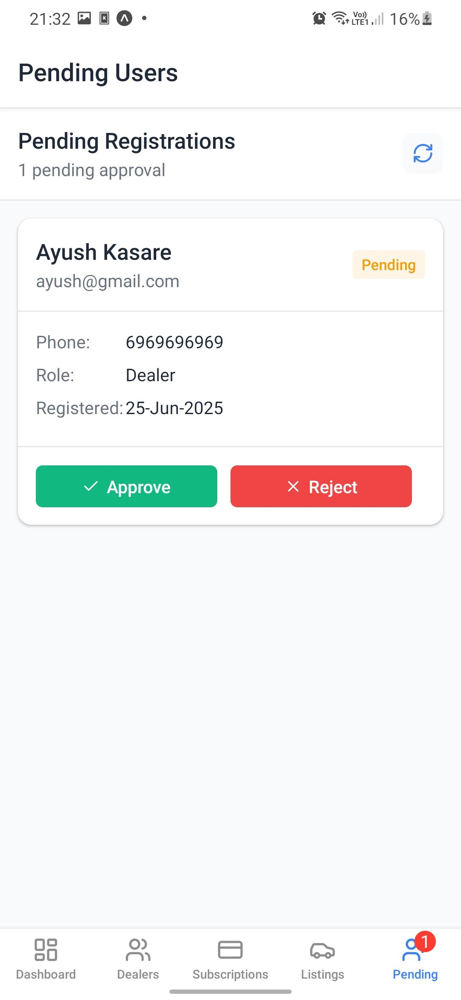

# CarBook B2B Car Dealer App

CarBook is a B2B platform designed for car dealers to manage vehicle listings, subscriptions, and dealer accounts efficiently. Built with Expo, React Native, Zustand, and Supabase, it provides a seamless experience for both admins and dealers.

---

## Features

- **Dealer Registration & Approval**: Dealers can register and are approved by admins before accessing the platform.
- **Admin Dashboard**: View stats, manage dealers, approve users, and monitor subscriptions.
- **Car Listings**: Dealers can list vehicles, upload images, and manage their inventory.
- **Subscription Management**: Flexible plans for dealers, with listing limits and plan upgrades.
- **Real-time Updates**: Live notifications for pending approvals and listing status.
- **Secure Storage**: Car images, videos, and audio stored securely with Supabase Storage.

---

## Screenshots

### Admin Dashboard


### Admin - Manage Dealers


### Admin - Pending Users


### Admin - Manage Subscriptions


### Admin - Listings


### Admin - Edit Subscription


### Dealer - All Listings


### Dealer - List Vehicle


### Dealer - Profile


### Dealer - My Listings


---

## Getting Started

### 1. Clone the Repository
```bash
git clone https://github.com/your-org/car-book.git
cd car-book
```

### 2. Install Dependencies
```bash
npm install
```

### 3. Configure Supabase
- Create a project on [Supabase](https://supabase.com/)
- Copy your Project URL and anon key
- Update `.env`:
  ```env
  EXPO_PUBLIC_SUPABASE_URL=your-supabase-url
  EXPO_PUBLIC_SUPABASE_ANON_KEY=your-anon-key
  ```
- Run the SQL scripts in `supabase/schema.sql` and `supabase/storage.sql` via Supabase SQL Editor

### 4. Start the App
```bash
npm start
```

---

## Folder Structure

- `app/` — Main app screens and navigation
- `components/` — Reusable UI components
- `store/` — Zustand stores for state management
- `lib/` — Supabase client setup
- `constants/` — App-wide constants
- `assets/` — Fonts and images
- `supabase/` — Database and storage SQL
- `types/` — TypeScript types

---

## Security & Real-time Features
- Row Level Security (RLS) on all tables
- Admins can approve/reject dealers
- Real-time notifications for pending users and listings
- Secure file storage for car media

---

## License

MIT License. See [LICENSE](LICENSE) for details.

---

## Credits

- Built with [Expo](https://expo.dev/), [React Native](https://reactnative.dev/), [Supabase](https://supabase.com/), and [Zustand](https://docs.pmnd.rs/zustand/getting-started/introduction).
